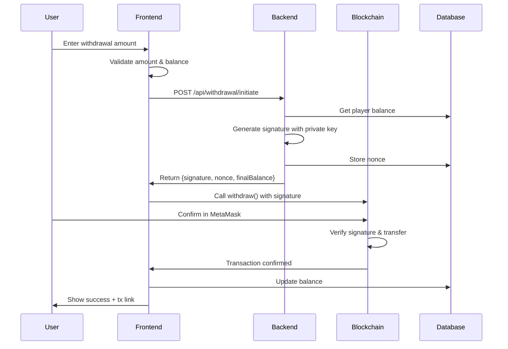

# 🎯 Withdrawal Implementation Complete

## Overview
Withdrawal feature telah berhasil diimplementasikan dengan signature-based authentication untuk keamanan maksimal.

## ✅ Completed Features

### 1. **Backend API** (`/api/withdrawal/initiate`)
- ✅ Generate ECDSA signature menggunakan `BACKEND_SIGNER_PRIVATE_KEY`
- ✅ Validasi player balance dari database
- ✅ Generate nonce untuk replay protection
- ✅ Mengembalikan signature + nonce untuk frontend

### 2. **GameWithdraw Contract Integration**
- ✅ Defined WITHDRAW_ABI dengan 5 parameters:
  - `player` (address)
  - `amount` (uint256)
  - `finalBalance` (uint256)
  - `nonce` (uint256)
  - `signature` (bytes)

### 3. **Frontend UI** (StoreView - Withdraw Tab)
- ✅ Display game balance (off-chain)
- ✅ Amount input dengan validation
- ✅ Transaction progress tracking:
  - `requesting` → Request signature dari backend
  - `signing` → Signature received
  - `withdrawing` → Submit to blockchain
  - `success` → Transaction confirmed
  - `error` → Handle errors
- ✅ Real-time status updates dengan loading animations
- ✅ PolygonScan transaction link
- ✅ Balance auto-refresh after withdrawal
- ✅ Help text dengan step-by-step instructions

### 4. **User Balance API** (`/api/user/balance`)
- ✅ Get real-time off-chain balance by wallet address
- ✅ Returns: balance, totalDeposited, totalWithdrawn
- ✅ Proper validation dan error handling

### 5. **Database Integration**
- ✅ Fetch player balance from Prisma
- ✅ Store nonce untuk replay prevention
- ✅ Get withdrawal history

## 🔄 Withdrawal Flow

### Step-by-Step Process:



### Code Example:

```typescript
// 1. User enters amount
setWithdrawAmount('100')

// 2. Frontend requests signature
const response = await fetch('/api/withdrawal/initiate', {
  method: 'POST',
  body: JSON.stringify({
    playerAddress: '0x...',
    amount: '100'
  })
})

const { signature, nonce, finalBalance } = await response.json()

// 3. Submit to blockchain
const hash = await writeContract(config, {
  address: WITHDRAW_ADDRESS,
  abi: WITHDRAW_ABI,
  functionName: 'withdraw',
  args: [
    address,
    parseUnits('100', 18),
    parseUnits(finalBalance, 18),
    BigInt(nonce),
    signature
  ]
})

// 4. Wait for confirmation
await waitForTransactionReceipt(config, { hash })

// 5. Refresh balance
await syncBalance()
```

## 🧪 Testing Guide

### Prerequisites:
1. ✅ Wallet connected to Polygon Amoy
2. ✅ Have GBC in game balance (from deposit or faucet)
3. ✅ Have MATIC for gas fees

### Test Scenarios:

#### ✅ **Test 1: Successful Withdrawal**
```bash
1. Go to "GBC Store" → Withdraw tab
2. Check game balance display
3. Enter withdrawal amount (e.g., 10 GBC)
4. Click "Withdraw to Wallet"
5. Expected: 
   - See "Requesting Signature..." alert
   - See "Signature Received!" alert
   - MetaMask popup appears
   - Confirm transaction
   - See "Withdrawing..." alert
   - See "Withdrawal Successful! 🎉" alert
   - Balance updates automatically
   - PolygonScan link appears
```

#### ✅ **Test 2: Insufficient Balance**
```bash
1. Enter amount > game balance
2. Click "Withdraw to Wallet"
3. Expected: "Insufficient Balance" error
4. Button should be disabled
```

#### ✅ **Test 3: Invalid Amount**
```bash
1. Enter 0 or negative amount
2. Expected: Button disabled
3. Try empty input
4. Expected: Button disabled
```

#### ✅ **Test 4: Wrong Network**
```bash
1. Switch to different network (not Polygon Amoy)
2. Expected: Warning alert shows
3. Button disabled
```

#### ✅ **Test 5: User Cancels Transaction**
```bash
1. Enter valid amount
2. Click withdraw
3. Reject MetaMask popup
4. Expected: "Withdrawal Failed" error
5. Can retry after 5 seconds
```

## 📊 UI States

### Transaction Progress:
- **Idle**: Initial state, ready for input
- **Requesting**: 🔄 "Requesting Signature..." (Blue alert + spinner)
- **Signing**: 🔄 "Signature Received! Preparing..." (Blue alert + spinner)
- **Withdrawing**: 🔄 "Withdrawing tokens..." (Blue alert + spinner)
- **Success**: ✅ "Withdrawal Successful! 🎉" (Green alert + tx link)
- **Error**: ❌ "Withdrawal failed" (Red alert)

### Button States:
- **Enabled**: Green button "Withdraw to Wallet"
- **Disabled**: Grayed out when:
  - Wrong network
  - Invalid amount
  - Amount > balance
  - Transaction in progress
- **Loading**: Shows spinner when processing

## 🔒 Security Features

### 1. **Signature Verification**
- Backend signs message with authorized private key
- Smart contract verifies signature on-chain
- Prevents unauthorized withdrawals

### 2. **Nonce System**
- Each withdrawal has unique nonce (timestamp-based)
- Stored in database for tracking
- Prevents replay attacks

### 3. **Balance Validation**
- Backend checks database balance before signing
- Frontend validates before submitting
- Smart contract should also validate (TODO: add on-chain balance check)

### 4. **Error Handling**
- Network validation
- Amount validation
- Balance checks
- Transaction failure handling
- User-friendly error messages

## 📝 Database Schema

### Transaction Record:
```typescript
{
  userId: string,              // User ID (wallet address)
  type: 'WITHDRAWAL',          // Transaction type
  amount: -100,                // Negative for withdrawal
  balanceBefore: 1000,         // Balance before tx
  balanceAfter: 900,           // Balance after tx
  status: 'PENDING',           // PENDING → COMPLETED
  referenceId: '0x...',        // Transaction hash
  metadata: {
    nonce: 1234567890,
    type: 'NONCE_RESERVATION',
    timestamp: '2024-...'
  }
}
```

## 🎨 UI Components Used

- **Alert**: Transaction status messages
- **Card**: Game balance display
- **Input**: Amount input field
- **Button**: Withdraw action button
- **Label**: Form labels
- **Lucide Icons**: 
  - `Loader2`: Loading spinner
  - `CheckCircle2`: Success icon
  - `XCircle`: Error icon
  - `ArrowUpCircle`: Withdraw icon
  - `Info`: Information icon

## 🔗 Contract Addresses

```env
NEXT_PUBLIC_WITHDRAW_ADDRESS=0x84eb5B86e53EB5393FB29131a5A30deBA8236cC3
BACKEND_SIGNER_PRIVATE_KEY=260755060d306bcff4f7624783761c360a556fca94d5c86b1bb94d8260d618d4
```

## 📈 Next Steps

### Required for Production:

1. **Smart Contract Update**
   - Add on-chain balance tracking
   - Integrate with game balance system
   - Add proper access control for signer

2. **Backend Enhancements**
   - Dedicated nonce table in database
   - Transaction history API endpoint
   - Webhook for blockchain confirmation

3. **Frontend Improvements**
   - Show pending withdrawals
   - Transaction history UI
   - Socket.IO real-time updates

4. **Testing**
   - End-to-end testing with real transactions
   - Load testing with multiple users
   - Security audit

## 🐛 Known Issues / TODOs

- [ ] Off-chain balance is placeholder (using blockchain balance)
- [ ] Need to integrate with actual game balance system
- [ ] Nonce stored in transaction metadata (should be dedicated table)
- [ ] No transaction history display yet
- [ ] No real-time updates via Socket.IO
- [ ] Smart contract doesn't track off-chain balances yet

## 📱 User Experience

### Before Withdrawal:
- User has 1000 GBC in game (from winnings)
- Wallet shows 50 GBC (on-chain)

### After 100 GBC Withdrawal:
- Game balance: 900 GBC
- Wallet balance: 150 GBC
- Transaction recorded in database
- Visible on PolygonScan

## 💡 Tips for Users

1. **Always have MATIC**: Need gas fees for withdrawal
2. **Check game balance first**: Make sure you have enough
3. **Wait for confirmation**: Don't close browser during withdrawal
4. **Save transaction hash**: Can verify on PolygonScan
5. **Check both balances**: Game balance and wallet balance update

## 🎉 Success Criteria

- ✅ User can withdraw GBC from game to wallet
- ✅ Signature properly verified on-chain
- ✅ Balance updates correctly
- ✅ Transaction tracked in database
- ✅ UI shows clear progress
- ✅ Error handling works properly
- ✅ PolygonScan link works

---

**Status**: ✅ **READY FOR TESTING**

**Next Action**: Test withdrawal with real transaction on Polygon Amoy testnet
